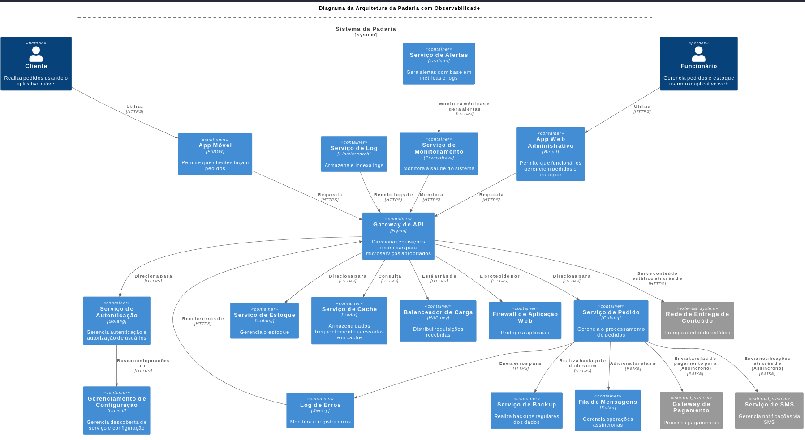

# Documentação Avançada do Projeto BreadMate para Analistas de Sistemas e DBAs

## Índice

1. [Análise de Sistemas](#análise-de-sistemas)
   1. [Arquitetura](#arquitetura)
   2. [Integrações](#integrações)
   3. [Escalabilidade](#escalabilidade)
   4. [Observabilidade](#observabilidade)
2. [DBA](#dba)
   1. [Esquema de Banco de Dados](#esquema-de-banco-de-dados)
   2. [Backup e Recuperação](#backup-e-recuperação)
   3. [Segurança](#segurança)
   4. [Manutenção e Monitoramento](#manutenção-e-monitoramento)

---

## Arquitetura

#### Microserviços

1. **API Gateway**: Utilizando Nginx, serve como o ponto de entrada para todas as chamadas de API.

   - **Alternativas**: Kong, Apigee
   - **Observabilidade**: Integração com Grafana e Prometheus para monitoramento. Sentry para log de erros.
2. **Autenticação e Autorização**: Utilizando Golang e opções para integrar com o Keycloak.

   - **Alternativas**: Auth0, Okta
3. **Serviço de Pedidos**: Responsável pela lógica de negócios associada aos pedidos.

   - **Alternativas**: Podem ser desenvolvidos em Python ou Java
4. **Serviço de Inventário**: Manutenção do estoque e outras informações relacionadas.

   - **Alternativas**: Podem ser desenvolvidos em Python ou Java

### Integrações

- **Gateway de Pagamento**: HTTPS para pagamentos.

  - **Protocolos Assíncronos**: Utilização de Kafka ou RabbitMQ para garantir a consistência.
- **SMS e Notificações**: Serviço de envio de SMS e outras notificações.

### Escalabilidade

- **Kubernetes**: Para orquestração e automação de deploy dos contêineres.
- **CD/CI**: Utilização de Jenkins ou GitLab CI para integração e entrega contínua.

### Observabilidade

- **Monitoramento**: Utilização de Grafana e Prometheus.
- **Log de Erros**: Utilização de Sentry para captura e análise de erros.

---

## DBA

### Esquema de Banco de Dados

- **Autenticação**: Tabelas para armazenar informações dos usuários, credenciais e tokens.
- **Pedidos**: Tabelas para armazenar pedidos, status, transações e histórico.
- **Inventário**: Tabelas para produtos, categorias e níveis de estoque.

#### Indexação e Otimização

- Planejamento de indexação apropriado para cada tabela.

### Backup e Recuperação

- **Automatização**: Scripts automatizados para backups diários.
- **Armazenamento**: Backups armazenados em AWS S3 com encriptação.

### Segurança

- **Firewalls**: Uso de WAF (Web Application Firewall) para proteção contra SQL Injection e outras vulnerabilidades.

### Manutenção e Monitoramento

- **Alertas**: Configuração de alertas para qualquer falha ou desempenho degradado.
- **Atualizações de Esquema**: Gerenciadas via migrações, com rollback suportado.

---

Espero que essa documentação aprofundada auxilie na implementação e manutenção do projeto BreadMate.
