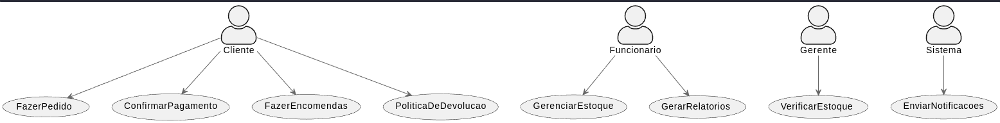
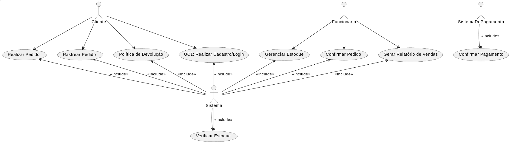

# Documentação do Projeto BreadMate

## Sumário

1. Introdução
2. Stakeholders
3. Visão Geral do Sistema
4. Casos de Uso Detalhados
5. Regras de Negócio
6. Políticas e Condições
7. Entidades e Atributos

## 1. Introdução

O projeto BreadMate visa a criação de um sistema de gerenciamento para padarias com foco em vendas online e in-store, suportando encomendas e várias formas de pagamento.

## 2. Stakeholders

- **Clientes**: Utilizam o aplicativo móvel para fazer pedidos.
- **Funcionários**: Utilizam uma interface web para o gerenciamento de pedidos e estoque.
- **Gerente**: Tem acesso a relatórios e configurações avançadas.
- **Admin de Sistema**: Encarregado da manutenção e monitoramento do sistema.

## 3. Visão Geral do Sistema

O sistema será desenvolvido usando uma arquitetura hexagonal. Os microserviços back-end serão implementados em Golang, e o front-end usará React. Todo o sistema será hospedado em um ambiente de nuvem.

## 4. Casos de Uso Detalhados

### Cliente

#### UC1: Realizar Cadastro/Login

- **Pré-requisitos**: Acesso ao aplicativo móvel ou site.
- **Fluxo Principal**: O cliente realiza o cadastro ou login utilizando redes sociais ou credenciais padrão.

#### UC3: Realizar Pedido

- **Pré-requisitos**: Cadastro e Login bem-sucedidos.
- **Fluxo Principal**: O cliente escolhe os produtos desejados, confirma o carrinho e efetua o pagamento.

#### UC4: Rastrear Pedido

- **Pré-requisitos**: Pedido realizado.
- **Fluxo Principal**: O cliente acompanha o status do seu pedido em tempo real.

#### UC9: Política de Devolução

- **Pré-requisitos**: Pedido recebido.
- **Fluxo Principal**: O cliente inicia o processo de devolução, que é então confirmado ou negado pela empresa com base na política de devolução.

### Funcionário

#### UC2: Gerenciar Estoque

- **Pré-requisitos**: Acesso ao painel administrativo.
- **Fluxo Principal**: Adicionar/remover itens do estoque.

#### UC5: Confirmar Pedido

- **Pré-requisitos**: Acesso ao painel administrativo.
- **Fluxo Principal**: O funcionário confirma o pedido feito pelo cliente após a validação do pagamento.

#### UC6: Gerar Relatório de Vendas

- **Pré-requisitos**: Acesso ao painel administrativo.
- **Fluxo Principal**: O funcionário gera relatórios de vendas com base em diferentes métricas.

### Sistema

#### UC7: Verificar Estoque

- **Pré-requisitos**: Produto adicionado ao carrinho.
- **Fluxo Principal**: O sistema verifica o estoque e permite ou impede a venda com base na disponibilidade.

### Sistema de Pagamento

#### UC8: Confirmar Pagamento

- **Pré-requisitos**: Cliente efetuou o pagamento.
- **Fluxo Principal**: O sistema de pagamento envia uma confirmação para o sistema BreadMate, que então notifica o cliente e a empresa.

## 5. Regras de Negócio

- Verificação de estoque antes da venda.
- Produtos sob demanda requerem pagamento antecipado.
- O pedido só é confirmado após a confirmação do pagamento.

## 6. Políticas e Condições

- Política de Devolução
- Política de Privacidade
- Termos e Condições

## 7. Entidades e Atributos

- **Produto**: ID, Nome, Preço, Estoque
- **Pedido**: ID, ID do Cliente, Status
- **Cliente**: ID, Nome, Email, Telefone

---

Essa documentação deve fornecer um ponto de partida bem estruturado para o desenvolvimento do projeto BreadMate. Diagramas em PUML para Caso de Uso, Classes e Arquitetura do Sistema seriam anexados separadamente devido à complexidade gráfica.
